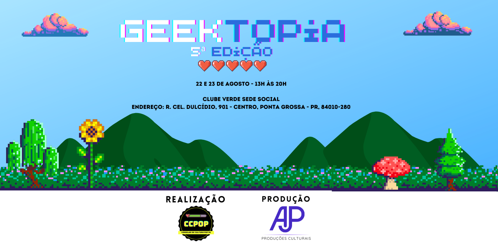

# 🎮 Geektopia - Portal Oficial do Evento



Portal oficial do **Geektopia**, o maior evento de cultura nerd e geek dos Campos Gerais! Um evento organizado pelo Conselho de Cultura POP de Ponta Grossa - PR.

## 🌟 Sobre o Projeto

Site moderno e responsivo desenvolvido para o evento Geektopia, mantendo o estilo pixel art retrô característico da cultura geek, mas com design profissional e recursos modernos.

### ✨ Características

- 🎨 **Design Pixel Art**: Estilo retrô gaming com fontes pixeladas
- 🌈 **Gradiente Animado**: Fundo dinâmico com cores vibrantes
- ⏰ **Contador Regressivo**: Contagem em tempo real para o próximo evento
- 🖼️ **Galeria Moderna**: Sistema de galeria com lightbox para visualização de fotos
- 📱 **100% Responsivo**: Otimizado para desktop, tablet e mobile
- ⚡ **Performance**: Animações suaves com GPU acceleration
- ♿ **Acessibilidade**: Foco visível e navegação por teclado

### 🎨 Paleta de Cores

- Verde Neon: `#68DA6A`
- Azul: `#2B6DDD`
- Roxo: `#8B5CF6`
- Rosa: `#EC4899`

### 🛠️ Tecnologias Utilizadas

- **HTML5**: Estrutura semântica moderna
- **CSS3**: Animações, gradientes e efeitos avançados
- **Bootstrap 5.3**: Framework CSS responsivo
- **Font Awesome**: Ícones vetoriais
- **GLightbox**: Galeria de imagens moderna e responsiva
- **AOS (Animate On Scroll)**: Animações ao rolar a página
- **Google Fonts**: Fontes Press Start 2P e VT323

### 📂 Estrutura do Projeto

```
geektopiapg/
├── index.html          # Página principal
├── style.css           # Estilos customizados
├── README.md          # Documentação
├── fonts/             # Fontes locais (se necessário)
└── images/            # Imagens e banners
    ├── banner2026.png
    ├── logo_ccpop.png
    ├── patrocinio.png
    └── [fotos das edições]
```

## 🚀 Deploy no Netlify

Este site está otimizado para hospedagem no Netlify:

1. Conecte seu repositório ao Netlify
2. Configure o build:
   - **Build command**: (deixe vazio)
   - **Publish directory**: `.` ou `/`
3. Faça o deploy!

### Deploy Manual

```bash
# Instale o Netlify CLI
npm install -g netlify-cli

# Faça login
netlify login

# Deploy
netlify deploy --prod
```

## 🎯 Próximo Evento

**Data**: 12 de Agosto de 2026  
**Horário**: 13:00  
**Local**: A definir

## 📸 Como Adicionar Fotos

Para adicionar mais fotos nas edições anteriores:

1. Coloque as imagens na pasta `images/`
2. Edite o arquivo `index.html`
3. Encontre a seção da edição desejada
4. Adicione um novo item na galeria:

```html
<a href="./images/sua-foto.jpg" class="glightbox gallery-item" data-gallery="edicaoX">
  
  <div class="gallery-overlay"><i class="fas fa-search-plus"></i></div>
</a>
```

## 🎨 Personalização

### Alterar Cores

Edite as variáveis no início do `style.css`:

```css
/* Cores principais */
#68DA6A  /* Verde */
#2B6DDD  /* Azul */
#8B5CF6  /* Roxo */
#EC4899  /* Rosa */
```

### Atualizar Data do Evento

Edite a linha no script do `index.html`:

```javascript
const eventDate = new Date("2026-08-12T13:00:00").getTime();
```

## 📱 Redes Sociais

- Instagram: [@geektopia.pg](https://www.instagram.com/geektopia.pg/)
- Instagram CCPOP: [@ccpop.pg](https://www.instagram.com/ccpop.pg/)
- TikTok: [@ccpop.pg](https://www.tiktok.com/@ccpop.pg)
- Email: cocpopg.contato@gmail.com

## 📄 Licença

Este projeto é de propriedade do Conselho de Cultura POP - Ponta Grossa.

## 🤝 Contribuindo

Para sugestões e melhorias, entre em contato através do formulário no site ou pelas redes sociais.

---

Desenvolvido com 💚 para a comunidade geek de Ponta Grossa
